# KnowledgeForge

## 项目简介

KnowledgeForge 是面向企业文档的多 Agent 知识管理平台。系统将文档解析、知识抽取、混合检索、知识图谱与证据驱动问答串联为闭环，并提供多租户权限、审计与任务治理能力。

## 界面总览

**工作台（组织治理中心）** —— 统一入口，按角色聚合评测治理、用户权限、审计与系统状态：

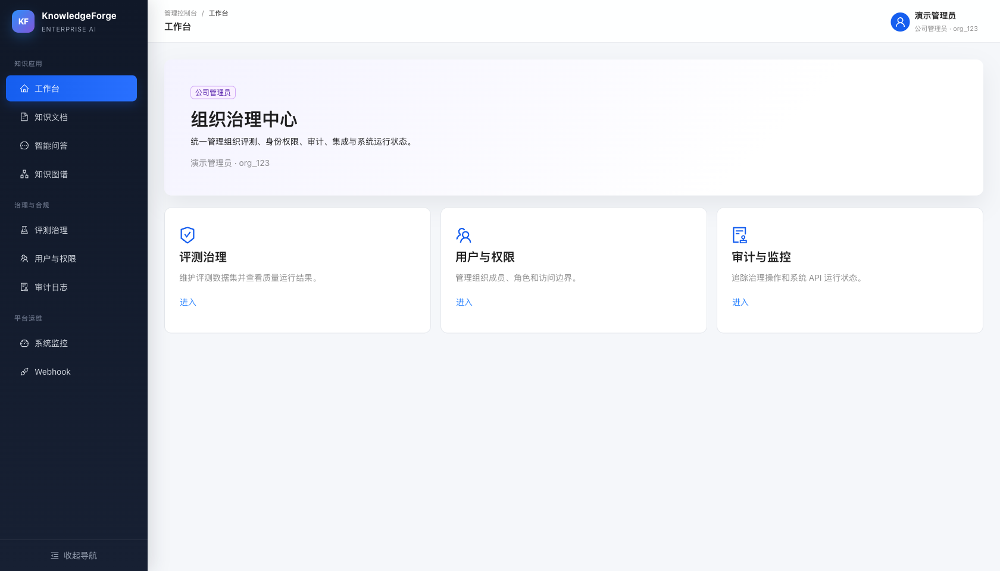

**知识文档** —— 文档入库状态、版本、分块与实体数量一览，支持部门过滤与分块预览：

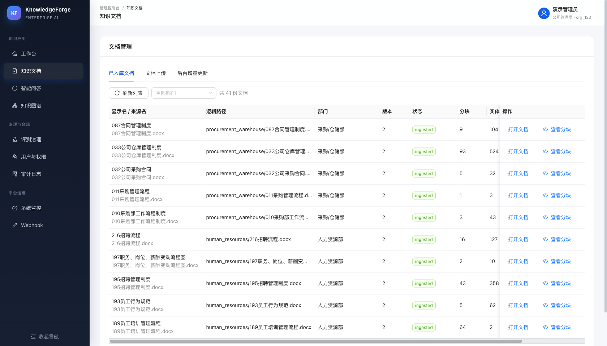

**智能问答** —— 证据驱动回答，附引用来源、置信度与推理步骤；证据不足时明确拒答：

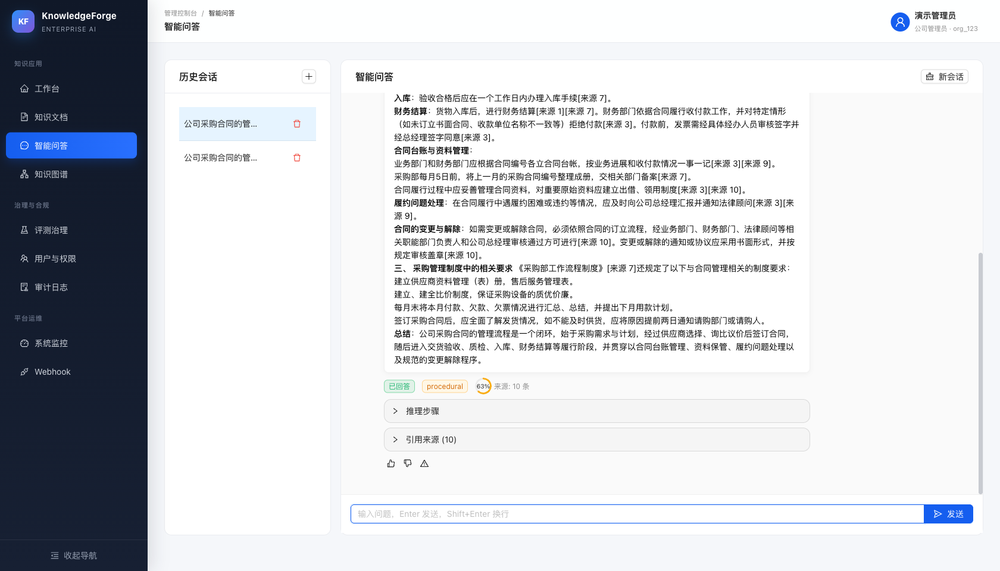

**知识图谱** —— 基于 Three.js 的 3D 交互图谱，展示公司与部门间的实体关系网络；点击任意部门节点即可下钻到部门内部的实体关系网络（人物 / 组织 / 概念 / 产品 / 事件 / 时间六类实体，支持按名称、类型、关系筛选）：

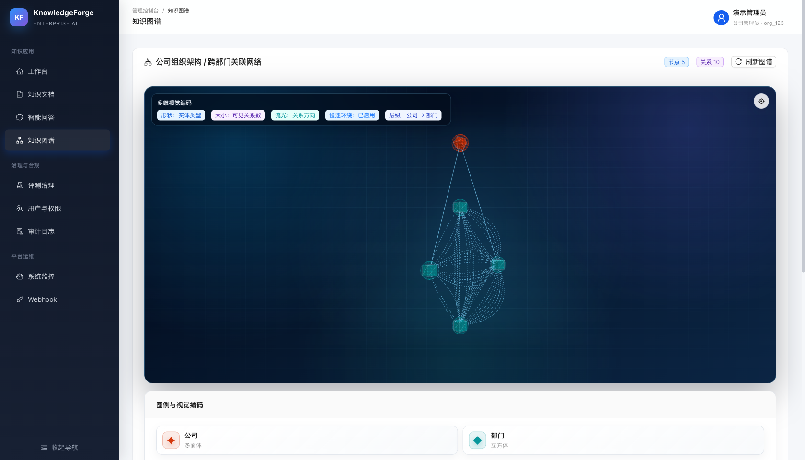

部门内部网络（财务部，161 个实体节点 / 186 条关系）：

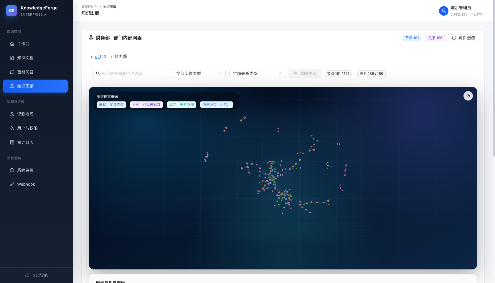

**评测治理** —— 评测样本制作、maker-checker 审核、数据集冻结与发布评测全流程：

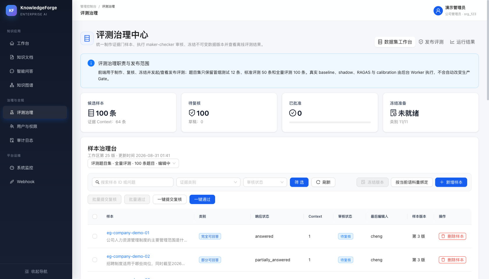

**用户与权限** —— 组织成员、角色（公司管理员/部门负责人/员工）与部门归属管理（示例中的用户名与邮箱已脱敏）：

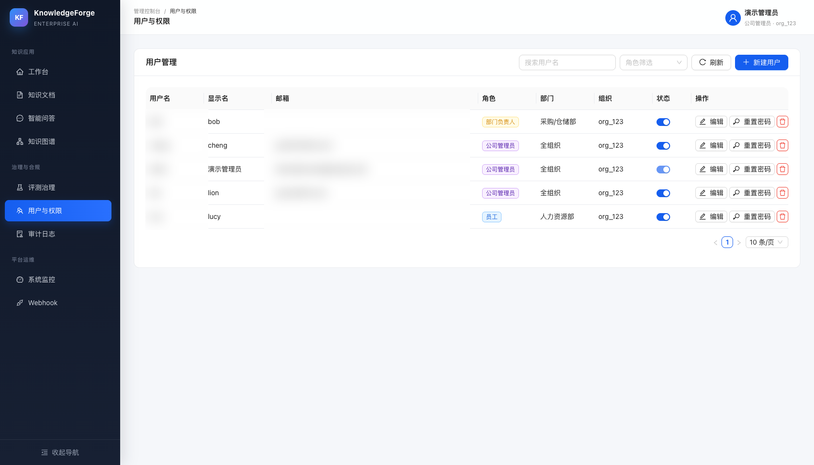

**评测运行结果** —— 离线评测运行列表，每次运行记录检索模式、评测口径、完成/失败数与无效溯源数：

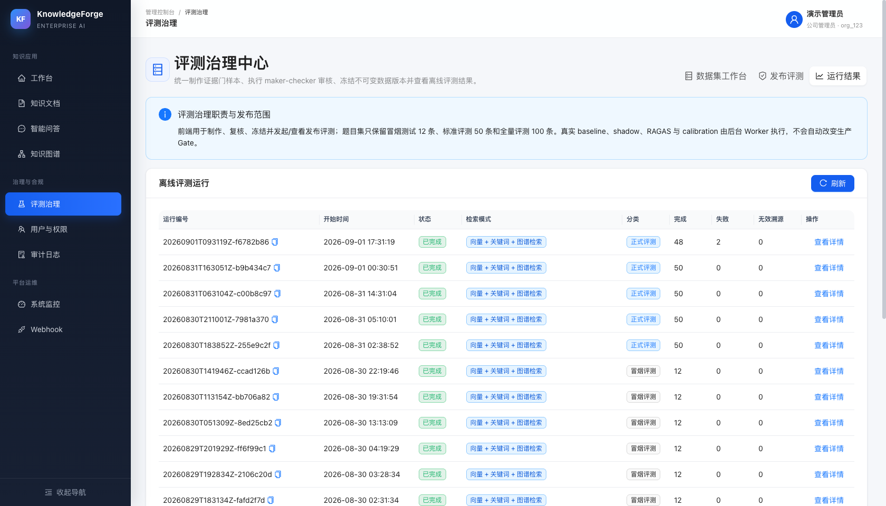

单次运行的评测报告：样本总数、有据回答通过率、可答题误拒率、拒答幻觉率、冲突识别率等行为契约指标，附检测质量与安全红线明细、需要人工抽检的警告：

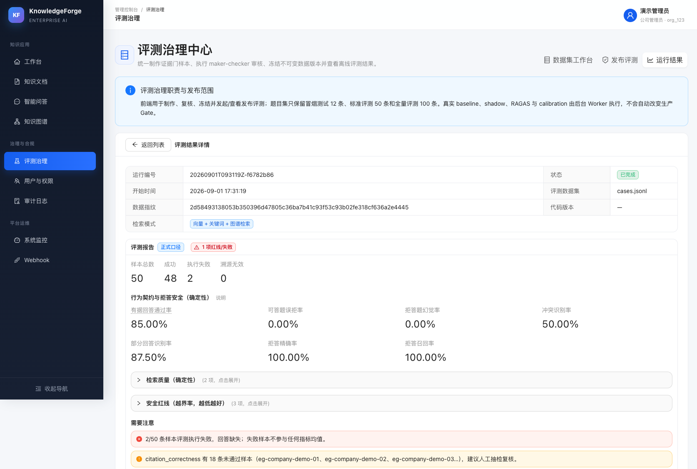

逐题结果明细：每条样本的检索模式、类别（权限过滤/证据冲突/部分可回答等）、状态与回答摘要，支撑发布前的逐题复核：

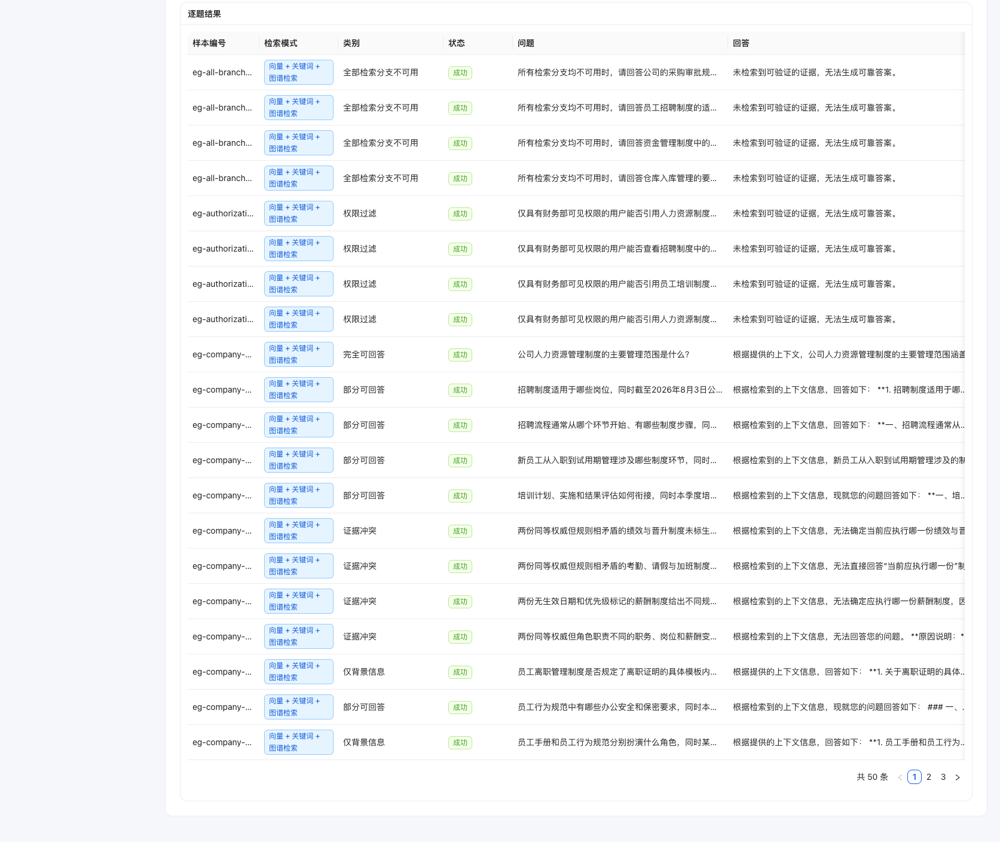

## 核心流程

### 知识入库

文档上传后经认证、RBAC 与多租户校验写入文档目录并进入 `parser` 队列；Parser Worker 异步完成解析、语义分块与实体/关系/事件抽取，**三路并行写入**向量库、图谱与 BM25 快照；三路全部成功后推进知识版本（问答缓存的失效依据），并通过 Kafka 广播生命周期事件：

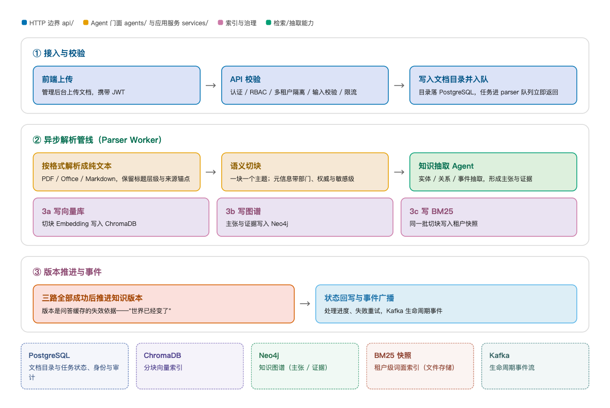

### 可信 RAG 问答

提问经 API 边界、安全校验与缓存判定后，由应用服务层完成意图分类与查询改写，并行执行向量、BM25 与图谱三路召回，过滤越权材料后 RRF 融合与可选精排；证据资格鉴定保证"证据充分才引用作答，证据不足受控拒答"，生成后再经引用与数值核验、内容安全复审才返回：

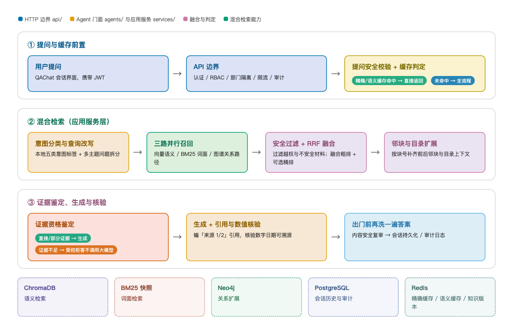

## 功能说明

- **智能知识入库：** 支持 PDF、Office、Markdown 等格式的文档上传、解析、语义分块、实体/关系/事件抽取、向量索引与知识图谱持久化；处理进度与失败重试全程可追踪。
- **多 Agent 工作流：** 文档解析、知识抽取、知识更新、问答 4 个 Agent 覆盖知识全生命周期；LangGraph 编排、Celery 异步任务、独立 parser 队列与 Kafka 事件流保证吞吐与可观测性。
- **可信 RAG 问答：** 融合向量检索、BM25 与图谱检索的三路混合召回加重排序；支持语义缓存、证据引用、置信度展示和证据不足拒答，答案附可展开的引用来源与推理步骤。
- **知识图谱可视化：** 基于 Neo4j、React Force Graph 3D 与 Three.js 展示公司/部门知识网络、实体关系路径和证据链路，支持多维视觉编码（形状/大小/流光/层级）。
- **企业治理：** JWT 认证、RBAC（公司管理员/部门负责人/员工）、API Key、多租户与部门数据隔离、限流、审计日志、Webhook 集成与系统监控。
- **评测治理：** 评测样本制作、maker-checker 审核、数据集冻结、baseline/shadow 发布评测与 RAGAS 质量门禁，保证问答质量的持续回归。冻结、评测、门控是三件分开的事，生产门控单独晋升、可回滚（运行列表、指标报告与逐题结果见上方"评测运行结果"截图）：

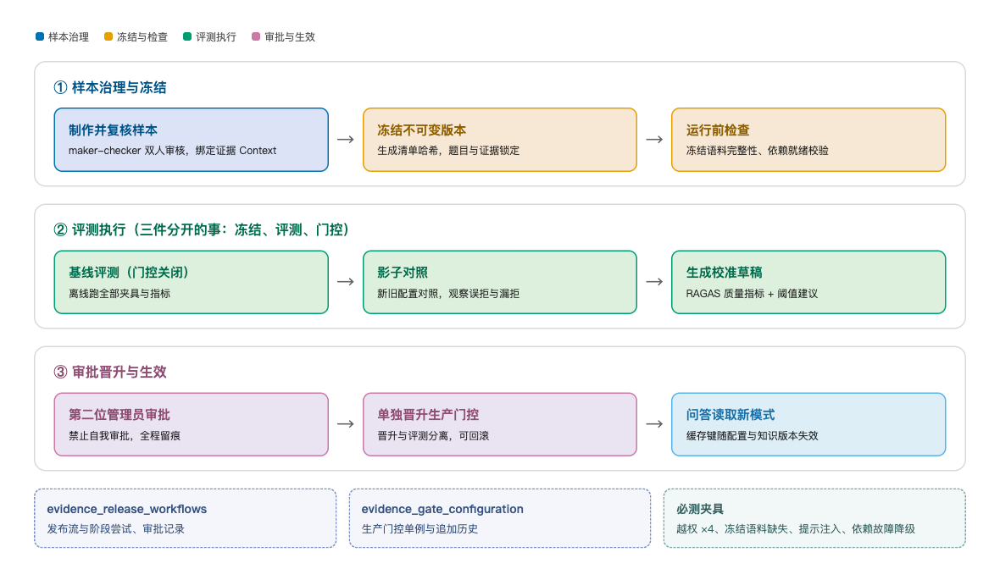

## 当前架构边界

系统运行形态：接入层（React + FastAPI）、异步计算层（双 Celery Worker + LangGraph 工作流）与数据层（PostgreSQL / ChromaDB / Neo4j / Redis / Kafka + 文件存储）三层解耦：

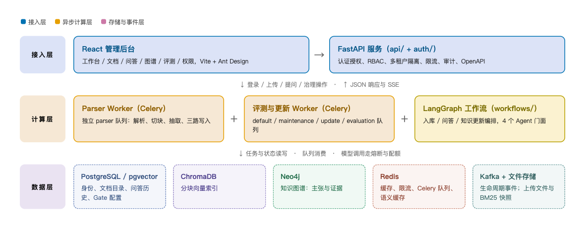

- **HTTP 边界**（`api/`）负责认证授权、输入校验和响应映射；路由按资源域拆分（评测治理路由在 `api/routers/evaluation_pkg/` 下按看板/发布流/草稿/数据集/案例/Fixture 分模块），文档与 QA Router 通过 FastAPI dependency provider 获取运行时协作者，不直接定位基础设施服务。
- **工作流边界**（`workflows/`）只承载 LangGraph 工作流与组合根；文档提交/生命周期等应用服务协调器位于 `services/documents/`。Celery task 只保留任务框架、队列、重试与上下文适配职责。
- **Agent 边界**（`agents/`）只放 4 个 Agent 门面及其私有协作模块（解析/分块 mixin、QA 缓存治理）；检索、排序、生成、安全管线、工具治理与证据资格等通用能力位于 **应用服务层**（`services/`，按 documents/qa/safety/evidence 主题分包）。依赖方向单向：`agents → services → {domain, infrastructure, shared}`。
- **领域边界**（`domain/`）保存稳定的身份、审计和内容安全契约；Redis/PostgreSQL、审计存储和 Guardrails 等具体实现位于基础设施适配层（`infrastructure/`），不能反向拥有 Agent 或认证服务类型。
- **身份事实来源**在组装后的运行时中固定为 PostgreSQL；内存适配器只允许测试显式注入，不作为生产 fallback。

这些约束由 `tests/unit/api/test_architecture_layout.py` 等架构测试防回归；后端文件系统锚点统一引用 `shared/paths.py`。代码位置、符号和调用链以 CodeGraph 与当前源码为准，不以 README 作为第二套代码地图。

## 技术栈

- **后端与 AI：** Python 3.12、FastAPI、LangChain、LangGraph、Celery
- **数据与检索：** PostgreSQL/pgvector、Neo4j、ChromaDB、Redis、Kafka
- **前端：** React 19、TypeScript、Vite、Ant Design、Zustand、React Force Graph 3D、Three.js
- **工程与部署：** pytest、Vitest、Docker Compose、Prometheus（应用指标暴露）

## 目录说明

```text
backend/       FastAPI 服务、Agent、应用服务层、工作流、领域模型、基础设施适配、评测与测试
  agents/        4 个 Agent 门面（文档解析、知识抽取、知识更新、问答）及私有协作模块
  services/      应用服务层：documents/qa/safety/evidence 主题分包（检索、生成、安全、证据资格）
  workflows/     LangGraph 工作流与组合根
  api/           HTTP 路由（按资源域拆分）、schemas 包、依赖注入与中间件
  domain/        领域契约与值对象（身份、审计、内容安全、文档、知识）
  infrastructure/ 基础设施适配：tasks/graph/postgres/cache/retrieval/audit/security/webhooks/documents
  evaluation/    评测治理：benchmarks/evidence_gate/ragas/release/company_demo 等主题分包
  shared/        配置、日志、指标、熔断、限流与文件系统锚点（paths.py）
frontend/      React 管理后台
config/        环境变量模板
images/        README 流程图与界面截图
docker-compose.yml  本地完整运行环境（Compose 是唯一部署方式，本地项目名 knowledgeforge）
```

## 启动与部署

### 前置要求

- Docker Engine 与 Docker Compose 2.24.4+；本地源码开发另需 Python 3.12、`uv` 和 Node.js/npm。
- 从 `config/.env.example` 创建 `config/.env`，替换数据库、Neo4j、JWT、Webhook 加密和模型服务占位值；真实配置不得提交。
- PostgreSQL schema 只通过显式 migration 管理，应用启动不会自动创建生产 schema。

### Docker Compose（推荐）

```bash
cp config/.env.example config/.env
# 编辑 config/.env，替换所有密钥、密码和服务占位值

docker compose --env-file config/.env config --quiet
docker compose --env-file config/.env build
docker compose --env-file config/.env up -d postgres
docker compose --env-file config/.env --profile tools run --rm postgres-migrate
docker compose --env-file config/.env --profile tools run --rm postgres-migrate \
  python -m infrastructure.postgresql_migrations status
docker compose --env-file config/.env up -d
```

检查服务与健康端点：

```bash
docker compose --env-file config/.env ps
curl -fsS http://127.0.0.1:8080/api/health/live
curl -fsS http://127.0.0.1:8080/api/health/ready
curl -fsS http://127.0.0.1:5173/healthz
```

启动后访问：

- 前端：`http://localhost:5173`
- API：`http://localhost:8080`
- OpenAPI 文档：`http://localhost:8080/docs`

首次空身份库需要显式创建组织管理员：

```bash
docker compose --env-file config/.env exec api \
  python -m infrastructure.scripts.bootstrap_admin \
  --username <admin-name> --email <admin-email> --org-id <organization-id>
```

### 本地开发

```bash
# 仓库根目录：先启动依赖服务
docker compose --env-file config/.env up -d postgres neo4j chromadb redis kafka

# 安装依赖并执行数据库 migration
UV_CACHE_DIR=.uv-cache uv --project backend sync --locked
PYTHONPATH=backend UV_CACHE_DIR=.uv-cache uv --project backend run \
  python -m infrastructure.postgresql_migrations upgrade

# 启动 API
PYTHONPATH=backend UV_CACHE_DIR=.uv-cache uv --project backend run \
  uvicorn api.main:app --reload --host 0.0.0.0 --port 8080

# 新终端：启动前端
cd frontend
npm ci
npm run dev
```

文档解析与后台入库依赖普通 Worker 和 Parser Worker。开发完整入库链路时，优先使用完整 Compose；若使用源码进程，必须按 `docker-compose.yml` 中当前队列参数分别启动两个 Worker，不要让普通 Worker消费 `parser` 队列。

## 验证

```bash
# 完整后端测试
PYTHONPATH=. UV_CACHE_DIR=.uv-cache uv --project backend run pytest -q

# 前端检查
cd frontend
npm run type-check
npm run lint
npm run build
```

## 文档入口

- [开发与架构强约束](AGENTS.md)
- API 契约以运行中的 `/openapi.json` 与 `/docs` 为准
